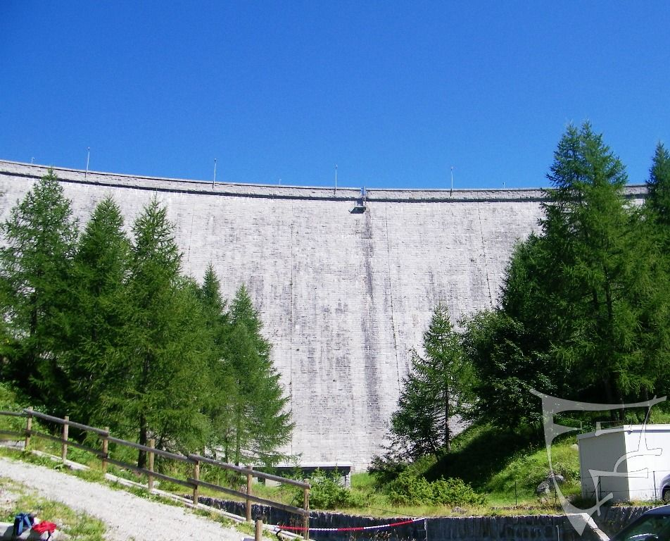

La diga di Agaro si trova in Ossola, presso una conca glaciale in val d’Agaro, affluente sinistro del torrente Devero. E’ stata costruita dall’Edison nel periodo dal 1936 al 1940 dagli ingegneri Claudio Marcello e Pietro Marinoni. 
Nel punto più profondo delle fondazioni, è alta 56.70 m mentre il coronamento è lungo 243 m. La diga ha un volume di 149.500 m&#x00B3;. La diga di Agaro è a gravità massiccia in muratura, con andamento planimetrico leggermente arcuato, con un raggio di 225 m.
La struttura è in blocchi di granito uniti da malta cementizia, fondati su una platea di calcestruzzo.
Il paramento di monte è in pietra unita da cemento extra - fine mentre il paramento di valle è in muratura. 
Al suo interno la diga è attraversata da tre cunicoli, a cui corrispondono due serie di tubi di drenaggio del diametro di 0.20 e 0.60 m.  I giunti di dilatazione sono disposti per tutta la lunghezza della diga ad una distanza costante di 16 m.
Il pietrame è stato preso in loco, mentre parte della sabbia per la malta cementizia è stata presa dal greto del fiume Toce nei pressi di Crego e trasportata alla diga attraverso una teleferica lunga 6 Km

### Struttura

Dettagli tecnici sulla struttura altezza

> dati di qualche tipo

### Scarichi

Lo sbarramento è dotato di tre scarichi, uno scarico di superficie della portata di 82 m3/s  situato in sponda sinistra, che comprende uno sfioratore lungo 36 m che alimenta il canale di scarico e una paratoia larga 3 m posta all’inizio del canale stesso. 
Lo scarico di fondo della portata massima di 126 m3/s è formato da una galleria in comune a quella di presa del diametro di 2.6 m, che scarica a valle della diga in sponda destra. Lo scarico di fondo ausiliario è costituito da una condotta metallica del diametro di 90 cm, per una portata massima di 11 m3/s

La diga attraverso una galleria in pressione lunga 2100 m e un salto di 487 m alimenta la centrale di Goglio. 

## Il paese sommerso

Agaro (Agher) con i suoi 1561 metri di altitudine era il villaggio più alto ed inaccessibile dell’Ossola: l’accesso da Baceno era difficile e pericoloso, battuto d’inverno dalle valanghe. Eppure per quasi sette secoli gli abitanti di questo microscopico comune, situato sul fondo di una conca chiusa da pareti rocciose, combatterono strenuamente per la sopravvivenza, finché nel 1938, si dovettero arrendere ai “superiori interessi della nazione”:  in quella data l’abitato venne sommerso sotto 20 milioni di metri cubi del bacino idroelettrico, deciso senza neppure consultarli. Ricevuto un indennizzo, si dispersero per la valle Antigorio.

## Come raggiungere la diga

AUTOSTRADA A26 VOLTRI SEMPIONE, in direzione SEMPIONE, continuare dritto seguendo le indicazioni "Confine di Stato", prendere l'uscita "CRODO/VALLE ANTIGORIO/VAL FORMAZZA (Cascate del Toce)" attraversando, nell'ordine, la galleria di Pontemaglio, Crodo, Baceno; 
al tornante centrale di Baceno girare a sinistra, seguendo le evidenti indicazioni per l'Alpe Devero.  
Attraversare Croveo e Goglio continuando in direzione "ALPE DEVERO": a poca distanza da Goglio, girare a destra in direzione Agaro: attenzione perchè la strada è stretta e senza protezioni.
Parcheggiare nella frazione AUSONE (composta da poche baite) o poco più in là, quindi continuare a piedi fino alla galleria percorrendola tutta fino all'uscita, proprio sotto la diga di Agaro.

### Precisazioni sulla galleria

La galleria è lunga 2 Km, l'illuminazione è settata a 30 minuti con un temporizzatore a bottone posto all'ingresso e all'uscita, da resettare obbligatoriamente entrando (per evitare di trovarsi al buio a metà percorso), umida e molto fredda, quindi occorrono abbigliamento adatto e torcia di emergenza. 
Il transito all'interno della stessa è evidentemente poco indicato per escursioni in solitaria.
Per contro, percorrerla in macchina, oltre ad essere vietato, è parecchio pericoloso in quanto è larga poco più di un'automobile e, in caso di problemi o fermo del mezzo, l'apertura delle portiere risulterebbe parecchio difficile, se non addirittura impossibile.

### Bibliografia

Formato https://www.scribbr.it/stile-apa/riferimenti-bibliografici-seguendo-le-regole-apa/

- Vari, (1964) Le dighe di ritenuta degli impianti idroelettrici italiani, Volume 2, ANIDEL
- CognomeAutore, InizialiNome. (Anno). TitoloLibro (Ausgabe). Città, Paese: Nome casa editrice.
- CognomeAutore, InizialiNome & CognomeAutore, InizialiNome. (Anno). Titolo Articolo. Titolo Rivista, Volume(Numero Issue), Numero di pagina.
- CognomeAutore, InizialiNome. (Anno, Giorno Mese). Titolo Articolo [TipoFonteInternet]. Disponibile, Giorno Mese, Anno, da http://URL

