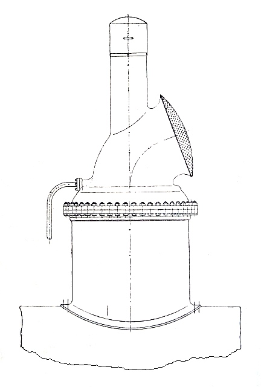
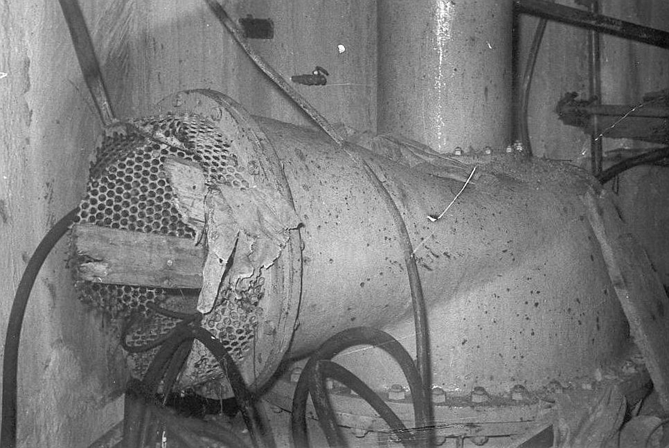
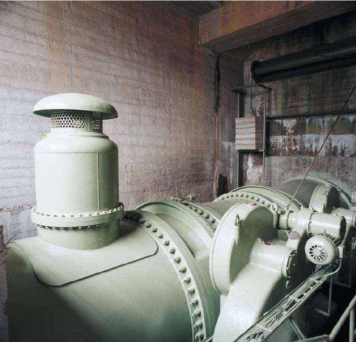
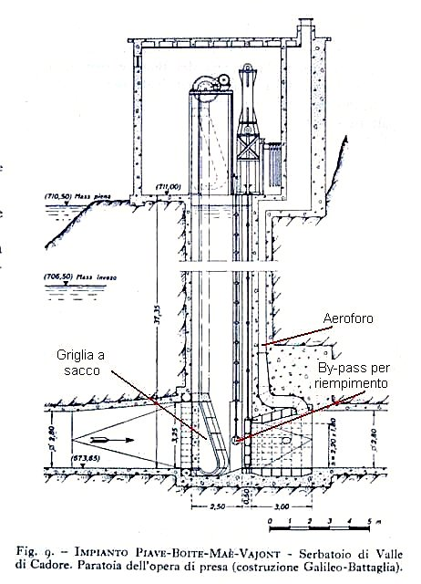
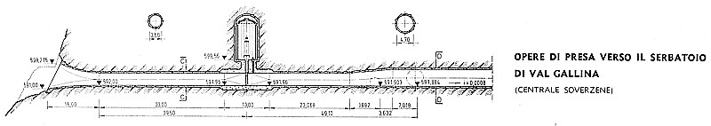
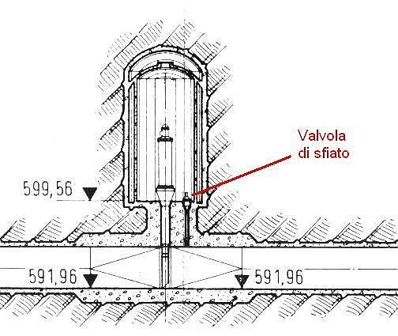
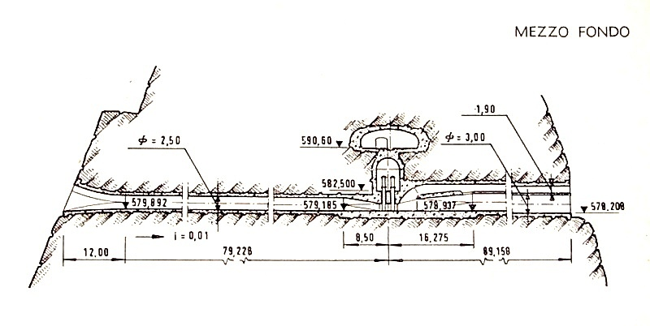
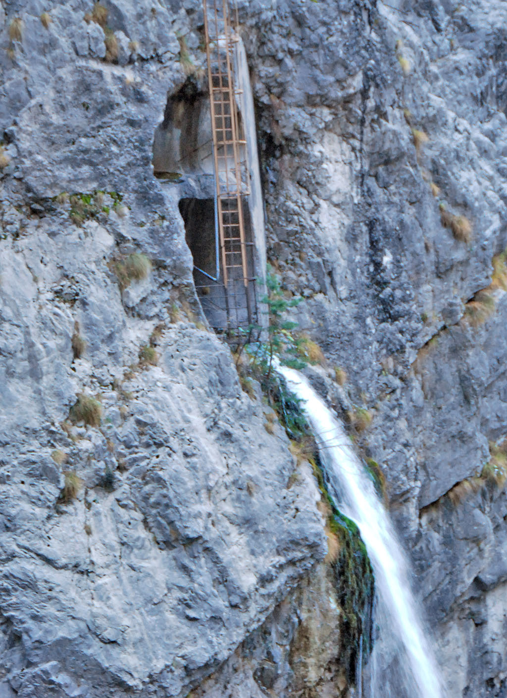

Here's a simple footnote,[^1] and here's a longer one.[^bignote]

[^1]: This is the first footnote.

[^bignote]: Here's one with multiple paragraphs and code.

    Indent paragraphs to include them in the footnote.

    `{ my code }`

    Add as many paragraphs as you like.

Negli impianti idroelettrici alimentati da dighe - e quindi con condotte d'acqua in pressione - ci sono vari dispositivi per controllare l'aria che può entrare o uscire dalle gallerie e dalle condotte forzate. Con funzioni diverse sono generalmente posizionati o all'inizio delle condotte forzate o alla partenza delle gallerie di derivazione dai laghi. 
All'inizio della condotta forzata l'organo di intercettazione (generalmente valvola a farfalla), in caso di rottura della tubazione a valle, si chiude automaticamente per arrestare il deflusso dell'acqua. E' allora necessario immettere dell'aria nella condotta, anche per impedirne lo schiacciamento per depressione. A questo provvede l'apertura automatica della valvola di rientrata aria, che è tenuta chiusa da un galleggiante. Nel riempimento della condotta, l'aria esce per la stessa valvola che il galleggiante chiuderà a riempimento completato. 

Alla partenza delle gallerie delle derivazioni dai laghi, subito a valle delle paratoie ci sono degli "aerofori" oppure delle "valvole di sfiato" a comando volontario. In questi casi il vuotamento e il riempimento sono programmati e con personale sul posto. Se la paratoia è in pozzo, il foro dell'aeroforo comunica con la camera di manovra all'esterno (fig. 4); se invece la camera di manovra è interna, lo sfiato è nella stessa camera (figg. 5 e 6). 

Nota. Diversa è la funzione degli aerofori a valle delle paratoie degli scarichi profondi delle dighe. Quando questi sono in funzione, l'aria è richiamata dalla depressione creata dal passaggio dell'acqua che passa dalla piena pressione a zero. Il richiamo è massimo alle piccole aperture delle paratoie e si annulla alla loro completa apertura (figg. 7 e 8). 

